 ## 프로젝트 개요
 
 무인도에 홀로 남겨진 사람이 섬 안에서 식사와 수면을 해결하며 섬에서 탈출하기까지의 과정을 AI를 통해 재현했다. 프로젝트에 등장하는 주요 객체들은 다음과 같다.

사람, 토끼, 과일나무, 풀, 부싯돌, 배

 섬 안에는 과일나무와 토끼가 있어 사람은 이 둘을 통해 식사를 해결하고, 천막에서 잠을 잔다. 섬 곳곳에는 부싯돌이 있어 사람은 이를 주워 지나가는 배에 신호를 보낼 수 있다. 토끼는 풀을 찾아 무리지어 이동한다. 한곳의 풀을 먹고 나면 다른 풀을 찾아 이동한다. 배는 일정시간 마다 섬 주변을 지나가고 사람이 배를 발견하면 섬의 중앙으로 올라가 배에 신호를 보낸다. 배는 신호를 발견하면 구조를 위해 섬으로 이동한다. 

 이를 좀 더 정확히, 각 객체마다의 행동으로 정리하면 다음과 같다.

사람 
 - 사람은 섬 안을 배회하며, 허기와 체력변수를 갖는다.
 - 배회 중 허기를 느끼면 식량을 찾고, 체력이 떨어지면 집으로 이동하여 잠을 잔다.
 - 식량으로는 토끼와 과일나무가 이용가능하다.
 - 잠을 자면 체력이 차고 그 후 다시 섬을 배회한다.
 - 배회 중 부싯돌을 찾으면 이를 줍는다. 주운 부싯돌의 개수가 많을수록 멀리 신호를 보낼 수 있다. 
 - 배회 중 배를 발견하면 섬 중앙으로 올라가 배에 신호를 보낸다. 배가 신호를 발견하지 못하면 다시 섬을 배회한다.   

토끼
- 섬 안을 무리지어 이동한다. 이동 중 풀을 발견하면 그 풀을 먹고 다른 풀을 찾아 다시 이동한다.
- 한 토끼가 사람에게 잡아먹히면 임의의 지점에서 새 토끼가 생성되어 전체 마리수를 유지한다.

과일나무, 부싯돌
- 정해둔 개수까지 섬의 곳곳에서 일정시간마다 생성된다.

배
- 일정시간마다 생성되어 섬 옆을 지나간다. 사람이 섬 중앙에서 보낸 신호를 발견하면 섬으로 이동한다.

## 프로젝트 상세 설명

map 구성

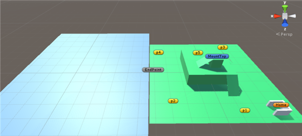

 - 그림 왼쪽의 파란 영역은 바다이고 배는 바다 안에서 움직인다. 오른쪽의 초록색 영역은 섬으로, 배를 제외한 나머지 객체들이 위치하는 곳이다.
 
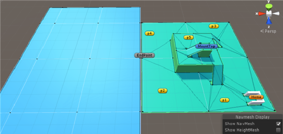

 - 두 영역 모두 NavMesh가 적용되어 영역 안에서 객체들이 NavMeshAgent를 이용해 이동 한다. 

- 섬에 표시된 p1 ~ p5는 사람과 토끼가 섬 안을 배회할 때 사용하는 지점이다. 한 지점에 도달하면 나머지 지점 중에 임의로 하나를 골라 그곳으로 이동한다.

- MountTop은 섬에서 가장 높은 지점으로, 사람이 배를 발견하면 MountTop으로 이동하여 신호를 보낸다. 배가 신호를 발견하면 사람은 EndPoint로 이동하여 배를 기다린다.  
- Home은 사람의 체력이 모두 떨어졌을 때 잠을 자는 지점(천막)이다.

표류자 AI

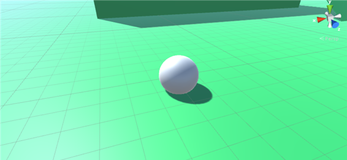

사람은 ‘구’로 나타냈으며 두 개의 센서를 가지고 있다(센서는 접촉을 통해 객체를 파악한다). 또한 사람의 상태에 따라 구의 색상이 바뀐다. 허기를 나타내기 위한 Hungry변수와 체력을 나타내기 위한 Helth변수, 주운 부싯돌의 개수를 나타내기 위한 Flints변수를 갖는다.  배에 신호를 보내기 위한 SOS객체를 포함한다. 

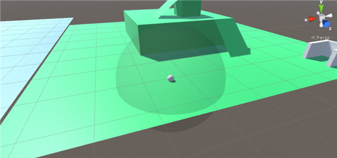

첫 번째 센서는 사람이 섬 안에서 마주친 객체가 무엇인지 파악한다.(이후 Sensor1로 명명)

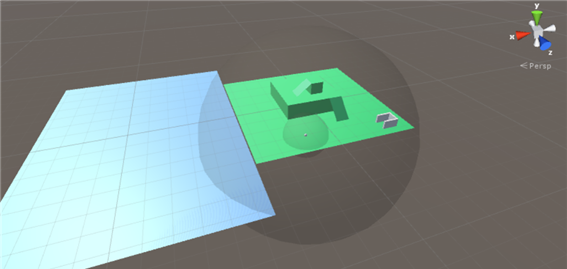

두 번째 센서는 섬 밖 배의 접근을 확인한다.(이후 Sensor2로 명명)
 
 사람의 상태를 나타내기 위해 FSM을 구현하였으며 상태의 종류는 다음과 같다. 

Wander
- 사람의 색을 흰색으로 한다.
- p1 ~ p5 중 임의이 지점으로 번갈아 이동한다
- Hungry가 50이하가 되면 LookForFood 상태로 전환된다.
- Helth가 0이 되면 GoToBed 상태로 전환된다.
- 부싯돌을 발견하면 GoToTarget 상태로 전환된다.

LookForFood

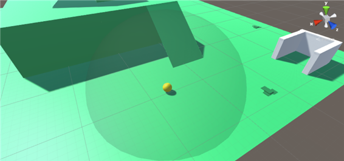

- 사람의 색을 노란색으로 한다. 
- Wander와 동일하게 p1 ~ p5를 번갈아 이동한다. 이동중 Sensor1이 토끼나 과일나무를 발견하면 GotoTarget 상태로 전환한다. 

GoToTarget

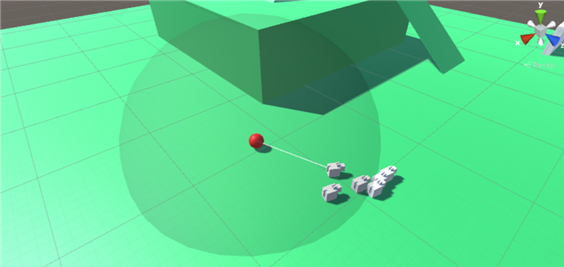

- 사람의 색을 빨간색으로 한다. 
- 이동중 발견한 객체로 접근한다. 타겟(토끼, 과일나무,부싯돌)은 사람과 충돌 후 삭제된다. 삭제 후 사람의 상태는 Wander로 전환된다. 타겟이 토끼나 과일나무의 경우에는 Hungry가 올라가며, 부싯돌일 경우 Flints가 1올라간다.

GoToBed

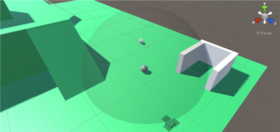

- 사람의 색을 회색으로 한다.
- 천막으로 이동하며 천막에 도착하면 Sleep 상태로 전환된다.

Sleep

- 사람의 색을 검은색으로 한다.
- 초당 Helth가 10씩 증가하며, Helth가 100이 되면 Wander로 전환된다.

GoToTop
- 사람의 색을 파란색으로 한다.
- SendSOS와 GoToEnd를 제외한 모든 상태에서 Sensor2가 배를 발견하면 GoToTop으로 전환된다. 섬의 중앙으로 올라가며 도착 후 SendSOS로 전환된다. 

SendSOS

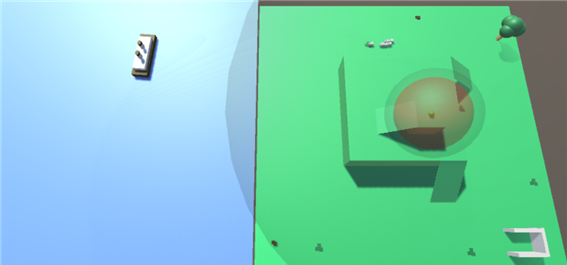

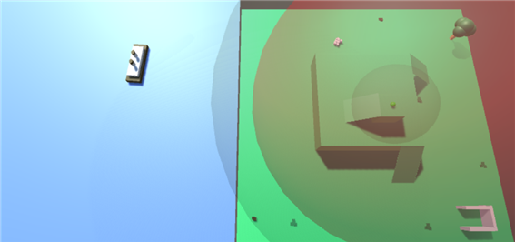

- 섬의 정상에 도착하면 Flints * 10 거리까지 sos 신호를 보낸다(신호가 퍼지는 모습은 붉은색의 '구'로 나타냈다). 신호가 배에 닿으면 배가 섬으로 접근하며, 사람이 배가 섬으로 접근하는 것을 확인하면(배 객체 내부의 변수를 통해 확인한다) GoToEnd 상태로 전환된다. 배가 접근하지 않으면 Wander 상태로 전환된다.

GoToEnd
- 사람의 색을 파란색으로 한다.
- EndPoint로 이동하여 배의 도착을 기다린다.

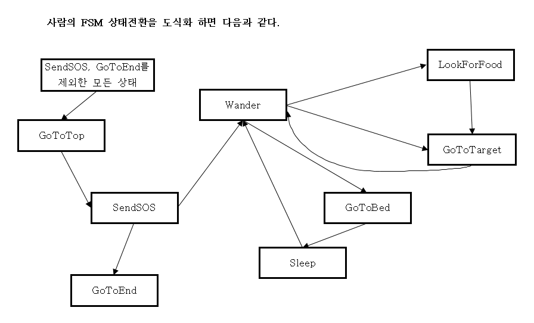

토끼 AI

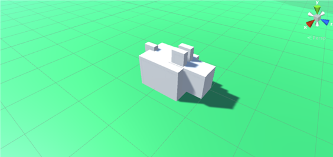

- 토끼는 무리지어 이동하는데 이를 위해 전체 토끼의 리더(이후 Leader로 명명)를 설정하고, 각 토끼의 NavMeshAgent의 목적지를 Leader의 위치로 두었다. 즉, Leader를 따라가게 하였다.
- Leader는 센서를 포함하고 있으며, p1~p5지점을 이동하다 풀을 발견하면 그 위치로 이동한다.

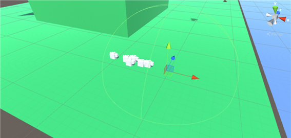

위 그림에서 보이는 좌표는 Leader의 좌표이며, 밝은 연두색 선으로 보이는 ‘구’는 leader의 센서이다.

Leader 또한 FSM을 구현하였는데 그 상태의 종류는 다음과 같다.

Wander
- p1 ~ p5지점을 이동한다. 센서가 풀(Grass)을 발견하면 GoToGrass로 전환된다.

GoToGrass

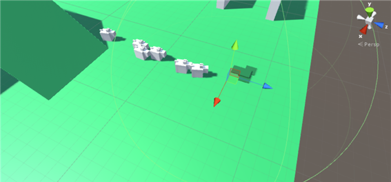

- 발견한 풀(Grass)의 위치로 이동한다. 도착하면 WatiEating으로 전환된다.

WaitEating

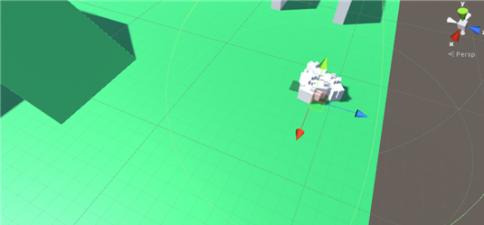

- 일정 시간동안 현재 지점에서 대기한다(토끼가 풀을 먹는 장면을 표현). 대기가 끝나면 현재 위치의 풀을 삭제한다. 삭제 후 Leader는 Wander상태로 전환되어 이동하고 나머지 토끼들이 따라간다.

## 프로젝트 실행 영상

<iframe width="640" height="360" src="https://www.youtube.com/embed/6Az2cNU7gUw" frameborder="0" gesture="media" allowfullscreen=""></iframe>

